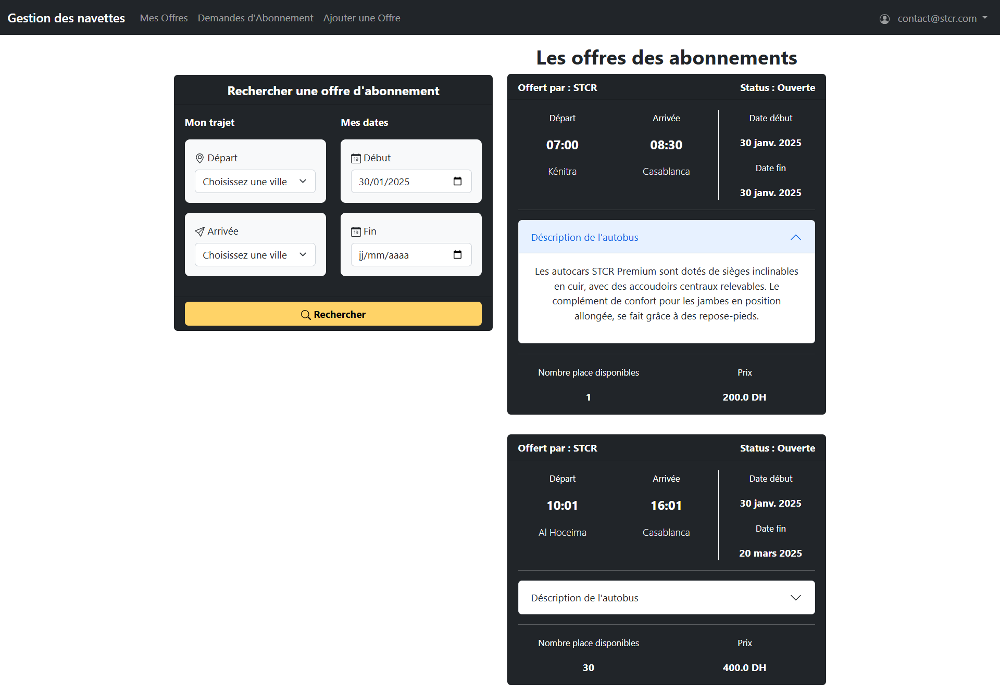
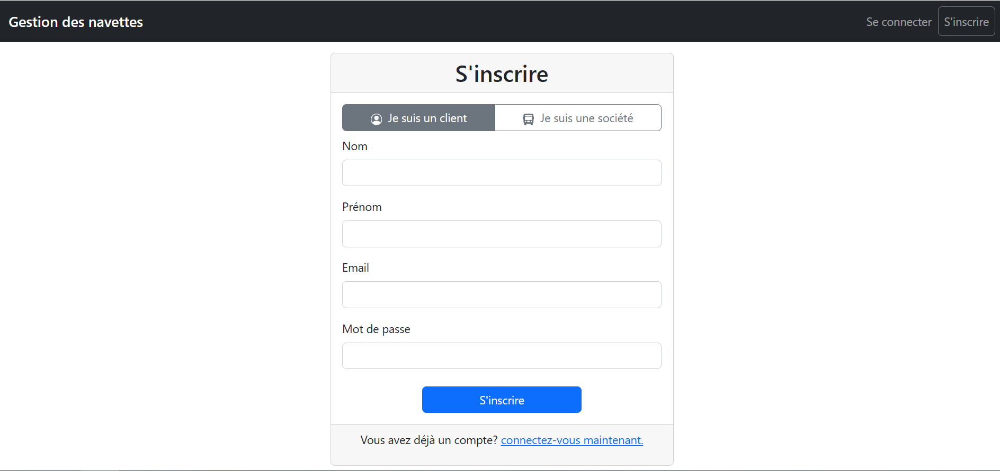
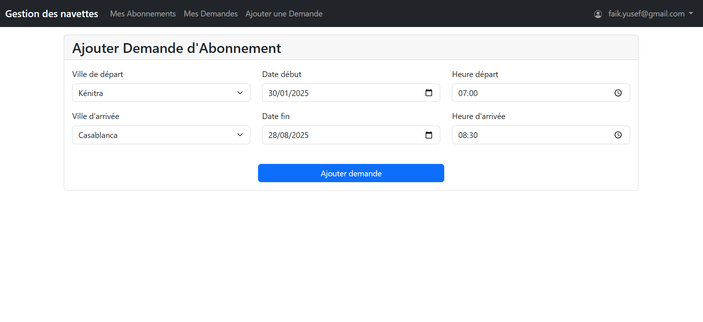
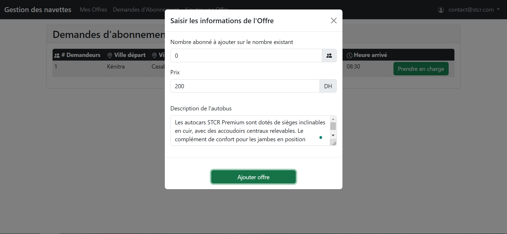
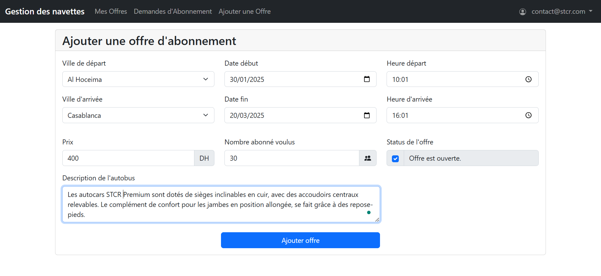

# Shuttle Management Platform

## Overview

The **Shuttle Management Platform** is a web-based solution that enables **transport companies** to offer **subscription-based shuttle services** while allowing users to **browse, subscribe, and request new routes**.

## Features

- **For Transportation Companies:**
    - Create shuttle routes between two cities with subscription offers.
    - Define subscription details including:
        - Subscription period (start and end date).
        - Departure and arrival times.
        - Departure and arrival cities.
        - Maximum or desired number of subscribers.
        - Shuttle details (e.g., air conditioning, number of seats).
    - View customer requests for subscriptions, including the number of interested users.
    - Manage customer requests and accept subscriptions.

- **For Users:**
    - Browse available subscription offers between cities.
    - Check the status of shuttle offers (active/closed).
    - Subscribe to an available shuttle offer after registering.

- **Subscription Request Management:**
    - Users can express interest in a shuttle service by submitting a request, which includes:
        - Departure and arrival cities.
        - Departure and arrival times.
        - Subscription period.
    - The platform ensures that duplicate requests are not submitted. If two users express the same request, the system notifies them that the request is already taken.
    - Transportation companies can review customer requests and manage them accordingly.


## Technologies Used

- **Backend**: Spring Boot
- **ORM**: Hibernate, Spring Data JPA
- **Database**: Oracle SGBD
- **Frontend**: Thymeleaf, Bootstrap
- **Security**: Spring Security

## Installation

1. Clone the repository:
    ```bash
    git clone https://github.com/youssef-faik/shuttle-bus-management.git
    cd shuttle-management-platform
    ```  

2. Configure the database connection in `application.properties`.

3. Build the project using Maven:
    ```bash
    mvn clean install
    ```  

4. Run the application:
    ```bash
    mvn spring-boot:run
    ```  

5. Access the platform at `http://localhost:8080`.

## Screenshots

### **Home Page**


### **Sign In**


### **Client - Create Request**


### **Company - Approve Request**


### **Company - Create Offer**


## Usage

- **Transport companies** can log in, create shuttle routes, and manage subscription offers.
- **Users** can register, browse available shuttle services, and subscribe to offers.

## Contributing

If you would like to contribute, feel free to fork the repository and submit a pull request.

---
Made with ❤️ by [Youssef Faik](https://github.com/youssef-faik)

